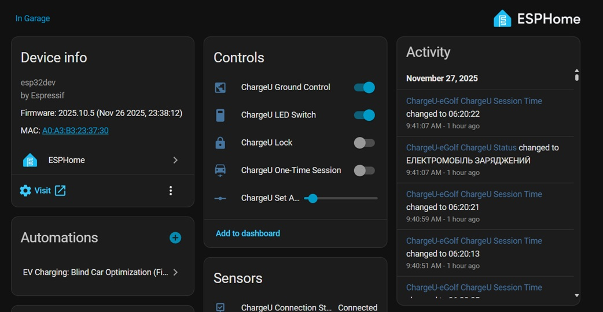
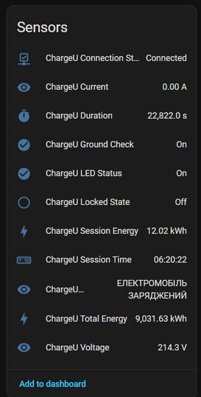
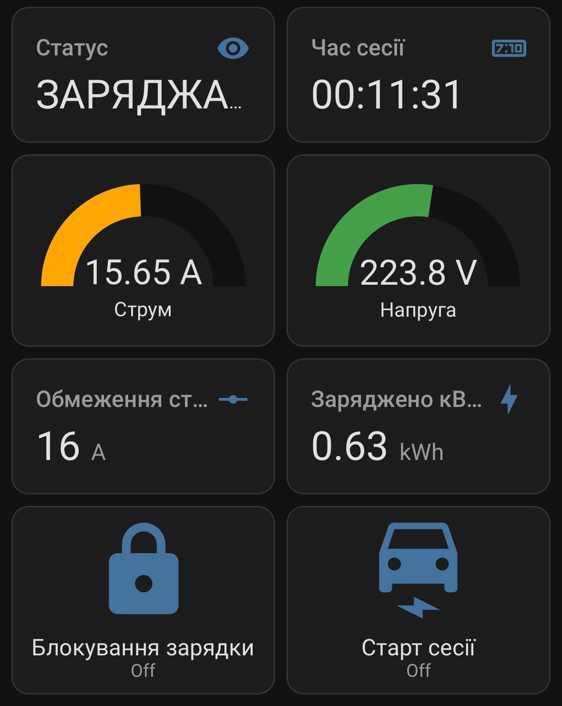

# Шлюз для зарядки ChargeU (ESPHome)

Просунутий шлюз на базі ESPHome для інтеграції зарядних станцій **ChargeU Base** в **Home Assistant**.

>Даний проект може бути використаний для інтгерації інших зарядних станцій, які мають лише WiFi точку доступу та працюють через Web-інтерфейс за адресою 192.168.4.1

Цей проект використовує плату **WT32-ETH01** як міст: вона підключається до Home Assistant через надійний **Ethernet**, і одночасно підключається до точки доступу зарядки через **WiFi**.


## 🚀 Можливості

* **Подвійне підключення:** Одночасна робота Ethernet (для HA) та WiFi (для зарядки).
* **Повний контроль:**
    * Встановлення сили струму (6А - 32А).
    * Керування світлодіодною індикацією (LED).
    * Керування перевіркою заземлення.
    * **Блокування/Розблокування станції** (Lock).
    * Активація "Разової сесії".
* **Розумна черга команд:**
    * Запобігає зависанню слабкого веб-сервера зарядки.
    * Інтервал опитування: 6 секунд для живих даних, миттєво для налаштувань.
* **Оптимістичний інтерфейс:** Миттєва реакція кнопок у Home Assistant з подальшою тихою перевіркою статусу (без "слайд-шоу").
* **Стабільність:** Алгоритм "Anti-Flap" фільтрує короткочасні втрати WiFi, щоб сенсори не ставали "Unavailable" без реальної причини.
* **Сенсори:** Напруга, Струм, Потужність сесії, Загальна енергія, Час сесії (форматований), Статус з'єднання.

## 🛠 Необхідне залізо

* **WT32-ETH01** (ESP32 з портом LAN8720).
* Блок живлення 5V/1A (через піни 5V/GND). **Важливо:** Не живіть плату від USB-TTL адаптера під час роботи, це може викликати збої WiFi/Ethernet.
* Ethernet кабель.

## ⚙️ Встановлення

### 1. Підготовка файлів
Скопіюйте файл `chargeu_component.h` у папку конфігурації ESPHome (зазвичай `/config/esphome/`, або `/homeassistant/esphome/`).

### 2. Налаштування
Відкрийте `chargeu_component.h` і впишіть дані WiFi вашої зарядки:
```cpp
const char* CHARGER_SSID = "CHARGEU base xxxx"; 
const char* CHARGER_PASS = "ващ_пароль";
const char* CHARGER_URL  = "[http://192.168.4.1](http://192.168.4.1)";
```
### 3. Прошивка
1. Скопіюйте вміст chargeu-gateway.yaml у новий пристрій в ESPHome Dashboard
2. Зробіть перемичку між IO0-GND.
3. Підєднайте плату за допомогою USB-TTL до комп'ютера.
4. Прошийте плату `Install → Plug into this computer` АБО `Install → Manual download (previously modern) → Перейдіть на https://web.esphome.io/ ат прошийте плату`
5. Від'єднайте від ПК, зніміть перемичку.
6. Подайте живлення 5V/1A на плату та під'єднайте до локальної мережі.
7. У інтеграції ESPHome має з'явитися новий device

> **Примітка: У конфігурації використовується board: esp32dev замість wt32-eth01, щоб уникнути конфліктів драйверів Ethernet. Піни налаштовані вручну.

# ⚠️ Відмова від відповідальності
Це неофіційна інтеграція. Використовуйте на свій страх і ризик. Автор не несе відповідальності за роботу вашої зарядної станції.

## 💡 Автор

- GitHub: [@chaichuk](https://github.com/chaichuk)  
- Telegram: [@serhii_chaichuk](https://t.me/serhii_chaichuk)

# Скріншоти з HA



